Este documento constituye la guía del usuario de la aplicación web Celia 360. Para las notas técnicas sobre instalación, remítase al archivo `install.md` distribuido junto con su código fuente. Para consultar la licencia de uso, remítase al archivo `licese.md`. No deje de consultar el archivo `readme.md` antes de proceder a la instalación y explotación de este software.

> **ATENCIÓN:** este documento, como la propia aplicación, aún está en desarrollo.

# Qué es Celia 360

Celia360, también conocido como CeliaTour, es una aplicación web creada por el alumnado de 2º curso del Ciclo Formativo de Desarrollo de Aplicaciones Web del IES Celia Viñas de Almería durante el año académico 2017/2018 bajo la dirección de los profesores D. Félix Expósito, D. Alfredo Moreno y D. José Barranquero. El alumnado autor del proyecto es, por orden alfabético:
- Benhachmi, Hamza
- Expósito, Marc
- González, Manuel
- Linares, Francisco Miguel
- López, Alejandro
- López Rodríguez, Miguel Ángel
- Lopez Segura, Miguel Ángel
- Ramírez, José Luis
- Salmerón, María Dolores
- Sánchez, Álvaro
- Sniurevicius, Zygimantas

Celia360/CeliaTour es una aplicación diseñada para crear recorridos virtuales a partir de fotografías panorámicas de 360º. 

La aplicación permite definir los mapas del lugar por donde va a transcurrir el recorrido virtual y asignar las fotografías panorámicas a los puntos exactos del mapa donde han sido tomadas. También permite conectar unas fotografías con otras para crear la sensación de "avance" de una escena a la siguiente.
Podemos crear puntos de interés (hotspots) dentro de las fotografías panorámicas. Los hotspots pueden ser de varios tipos:

* Paneles: son galerías de imágenes de un lugar concreto del recorrido. Pueden usarse para mostrar detalles que no se aprecien bien en la imagen 360.
* Audios: audiodescripciones de ese lugar.
* Vídeos: vídeos relativos a ese lugar.
* Enlaces: puntos de salto de una escena a otra para crear el recorrido virtual.
* Escalera: puntos de selección de los distintos planos, para saltar de una planta a otra del mismo edificio, por ejemplo.

La aplicación no se limita a eso, sino que además permite crear una visita guiada que traslade al visitante automáticamente a través de los lugares más destacados del tour virtual, acompañado de una audiodescripción. Existe un tercer tipo de visita, la de puntos destacados, donde usted podrá seleccionar algunos lugares importantes de su visita que se mostrarán en una sola pantalla mediante un mosaico para que el usuario pueda elegir a dónde quiere ir.

También podemos poner online una biblioteca de libros y/o documentos digitalizados con información sobre el lugar que estamos virtualizando. Los libros podrán consultarse y leerse online.

Por último, la aplicación permite personalizar el *homepage* para adaptarlo al lugar del cual se quiere realizar el recorrido virtual.

# Instalación de Celia 360

La instalación de Celia360 implica el despliegue de la aplicación web en un servidor. Este proceso puede entrañar cierta dificultad si usted no está familiarizado con ello, por lo que puede requerir la colaboración de un administrador de sistemas para completarlo con éxito.

Los requerimientos de la aplicación son:

* Un servidor web son soporte para PHP 5.5 o superior.
* Un servidor MySQL 5.5 o MariaDB 10 o superior.
* Una conexión FTP con su servidor.

Los pasos generales para la instalación son los siguientes:

1. Copie el código fuente de la aplicación en un directorio de su servidor accesible vía web. Puede obtener la última versión del código fuente del repositorio de GitHub.
2. Cree una base de datos en su servidor MySQL o MariaDB. Recuerde las credenciales de esta base de datos (nombre de la base de datos, usuario y contraseña). Su usuario debe tener privilegios suficientes para escribir y leer en esa base de datos.
3. Ejecute el script `install.php` ubicado en el directorio raíz de su instalación. Si, por ejemplo, ha desplegado el código en un directorio llamado mi-tour dentro de un servidor llamado mi-servidor.com, puede lanzar el script escribiendo en su navegador web: `http://mi-servidor.com/mi-tour/install.php`
4. Siga las instrucciones de la instalación. El programa de instalación creará las tablas necesarias en la base de datos y las dotará del contenido mínimo imprescindible para que la aplicación funcione. En particular, creará un usuario superadministrador para el panel de administración de la aplicación. Se le pedirá que introduzca un nombre de usuario y una contraseña para ese usuario. Ni que decir tiene que si ese usuario y contraseña caen en malas manos, la integridad completa de su aplicación podría verse comprometida.
5. El programa de instalación tratará de crear un archivo de configuración, pero este paso podría fallar por un gran número de razones que dependen de la configuración de su servidor. Si es así, el programa de instalación le informará de ello y le explicará qué archivo de configuración debe crear, dónde debe crearlo y cuál debe ser su contenido. Puede usar su conexión FTP para lograrlo. Si todo va bien, el programa de instalación se encargará de este paso y usted no tendrá que hacer nada.
6. Por último, y por motivos de seguridad, debería eliminar el script de instalación (`install.php`) de su servidor. Puede usar su conexión FTP para ello. Este paso no es imprescindible para que la aplicación funcione, pero sí muy recomendable.

Cuando la instalación haya terminado, su tour virtual estará listo para usarse en su servidor. Ahora ha llegado el momento de cargar todos los datos necesarios en la aplicación para construir su tour virtual. En las siguientes secciones de este manual le daremos las orientaciones necesarias para lograrlo.

# Primeros pasos con Celia 360

Celia360 proporciona dos puntos de vista al usuario:

1. Visita virtual: es la parte que normalmente verán los visitantes de la página. Proporciona acceso a los tres modos de visita (libre, guiada y puntos destacados) así como a la biblioteca.
2. Panel de administración: es la parte que solo ven los administradores de la aplicación. Desde aquí podemos cargar y organizar la información que se verá en las visitas virtuales: mapas, imágenes panorámicas 360º, galerías de imágenes, audios, vídeos, biblioteca, etc.

La **visita virtual** está organizada en torno a un menú con cuatro opciones. Su uso es bastante intuitivo y no entraremos en detalle en el mismo en este manual. Solo las mencionaremos por encima en esta sección.

Nota: las vistas de la aplicación son personalizables, por lo que puede que encuentre diferencias entre su aplicación y las siguientes capturas de pantalla. A pesar de esas diferencias estéticas, la funcionalidad de la aplicación siempre será la misma.

Las cuatro opciones de la visita virtual son:

1. Visita libre: permite al usuario moverse con libertad por todo el tour virtual.
2. Visita guiada: muestra solo algunos de los lugares de la visita virtual, acompañados de una audiodescripción. La visita avanza automáticamente de una zona a la siguiente, aunque el usuario puede detenerla en cualquier momento o saltar de una zona a otra con libertad.
3. Puntos destacados: muestra una selección con los puntos más destacados de la visita y permite al usuario acceder a la imagen 360º de ellos directamente.
4. Biblioteca: accede a los libros digitalizados con información sobre el lugar de la visita y permite leerlos con un visor interactivo.

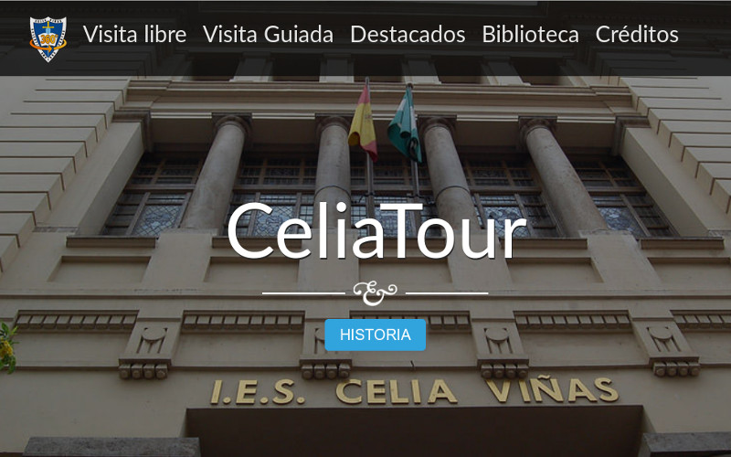

Además, observe que en el centro de la pantalla aparece un botón etiquetado como "Historia". Esto da acceso directo a un subconjunto de los libros de su biblioteca. Está pensado para que incluya aquí los libros o documentos que se refieran a la historia del edificio o lugar cuya visita está virtualizando. No obstante, si usted no desea hacer uso de esta posibilidad, podrá ocultar tanto el botón "Historia" como la opción "Biblioteca" del menú principal.

En cuanto al **panel de administración**, es la parte de la aplicación proporciona todas las funcionalidades para crear los mapas, subir las imágenes 360º, así como otras imágenes, audios y vídeos, y relacionarlos todos entre sí para componer nuestra visita virtual. También podemos crear la biblioteca online y personalizar el homepage de la aplicación.

Aunque el panel de admistración ha sido diseñado para facilitarle al máximo esta labor, tenga en cuenta que la creación de una visita virtual completa es un proceso largo y complejo que requiere del manejo de grandes volúmenes de información, por lo que le aconsejamos que planifique cuidadosamente el mismo antes de crearlo con nuestra aplicación. Esa planificación debería consistir en:

1. Hacerse con unos planos digitalizados y detallados del lugar que pretende virtualizar. Le recomendamos que consiga una copia impresa y otra digitalizada de los mismos.
2. Marcar en el plano los lugares en los que va a realizar una fotografía 360º. No deberían estar ni demasiado separados entre sí ni demasiado próximos. Una distancia de alrededor de diez metros entre una imagen y la adyacente puede ser apropiada en la mayoría de los casos.
3. Cuando vaya haciendo las fotografías, marque en el plano qué fotografías ha hecho y asígneles un nombre representativo del lugar. Tenga en cuenta que puede llegar a acumular una cantidad notable de fotografías y puede resultarle difícil saber en qué lugar exacto fueron tomadas cuando vaya a subirlas a la aplicación.

Con esos elementos, puede empezar a trabajar con la aplicación. En el resto de este documento entraremos en detalle en cada proceso, pero ahora le indicaremos cuáles son los primeros pasos que deberá dar para tener una primera versión de su tour virtual funcional, de manera que pueda añadirle más adelante nuevos elementos, tales como paneles de imágenes, audiodescripciones o vídeos. En el [anexo]("#anexo") encontrará una guía rápida para desplegar una aplicación completa y con todos los elementos en su servidor, aunque para ello deberá estar familiarizado antes con la aplicación, por lo que le recomendamos que lea antes el manual de usuario en su totalidad y haga algunas pruebas previas.

La operativa general para comenzar a trabajar con una instalación limpia, una vez que tenga las fotografías panorámicas 360º tomadas y organizadas, es la siguiente:

1. Entre en el panel de administración escribiendo en su navegador la dirección http://mi-servidor.com/mi-aplicacion/usuario, donde "mi-servidor.com" es el host donde tiene usted instalada su aplicación y "mi-aplicacion" es el directorio donde ha efectuado el despliegue del código. Si desconoce estos datos, póngase en contacto con su administrador de sistemas.
2. Teclee su nombre de usuario y contraseña de administrador. Un usuario administrador se habrá creado durante el proceso de instalación. Si la instalación la realizó su administrador de sistemas, consúltele a él su nombre de usuario y contraseña.
3. El panel de administración se abrirá en el administrador de escenas. En primer lugar, tiene que crear sus mapas. Haga clic en "Admin. Mapa" y cree al menos una zona del mapa. Si no sabe hacer esto, consulte [la sección 4](#mapa) de este manual.
4. Cuando haya finalizado con la administración del mapa, pulse "Volver atrás" para regresar a la administración de escenas.
5. Haga clic en la zona del mapa donde quiera asignar una fotografía panorámica 360º para crearla. Si tiene problemas con esto, consulte [la sección 5](#escenas) de este manual.
6. Cuando haya subido todas las fotografías panorámicas, debe conectarlas unas con otras para crear el contenido. Debe entrar en cada escena y crear al menos un hotspot de tipo "enlace" en cada uno de ellos. Para más detalles sobre cómo hacer esto, consulte [la sección 7.1](#enlace) de este manual.

Cuando haya terminado este proceso ya tendrá una primera versión funcional de su tour virtual. Podrá realizar con ella una visita libre por las escenas que haya subido. Su plataforma está ahora lista para crear hotspots (puntos de interés) dentro de sus escenas, así como para subir audiodescripciones y crear una visita guiada o una visita de puntos destacados. Su visita virtual podrá crecer tanto como usted desee, utilizando como base las escenas 360º entrelazadas que usted acaba de crear. Le explicaremos cómo lograr todo esto en las siguientes secciones.

# Crear el mapa

Después de la instalación, una de las primeras cosas que tendrá que hacer con la aplicación es crear el mapa. En esta sección del manual le explicaremos cómo hacerlo. También le mostraremos cómo puede modificar el mapa de su tour virtual una vez que ya está creado.

Para administrar el mapa, primero debe loguearse en la aplicación como un usuario con privilegios de administrador general o de administrador del mapa. Vea [la sección de administración de usuarios](#usuarios) para aprender más acerca de los tipos de usuario y de cómo administrarlos.

Para loguearse en la aplicación debe escribir en un navegador web la dirección: http://servidor/directorio/usuario (también podría ser https), donde debe sustituir "servidor" por el host donde haya desplegado el software y "directorio" por la carpeta donde lo haya hecho. Esta carpeta podría estar en blanco si el despliegue se ha realizado en el directorio raíz de su servidor. Consulte con su administrador de sistemas o la persona que haya realizado el despliegue si tiene dudas a este respecto.

Por ejemplo, la dirección para acceder al formulario de login podría tener un aspecto como este: http://iescelia.org/celia360/usuario

Cuando acceda a esa dirección, podrá ver un formulario como este:

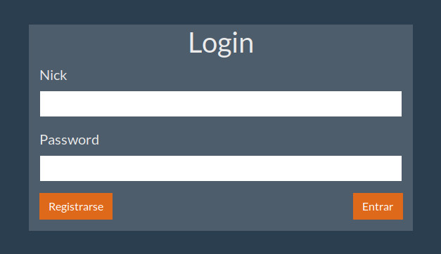

Deberá teclear un nombre de usuario y una contraseña válidos para acceder a la aplicación. Una vez hecho esto, se encontrará con una pantalla semejante a esta (las opciones pueden variar dependiendo de sus privilegios de usuario):

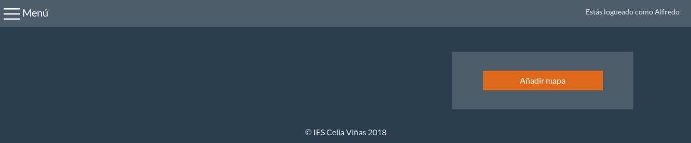

Haga clic en el botón "Admin. Mapa" para acceder a las siguientes opciones de administración del mapa:

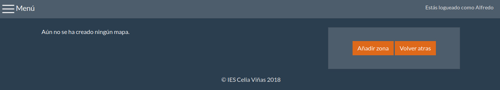

Las opciones de administración del mapa son las siguientes:

* **Añadir zona**: permite añadir un plano sobre el que posteriormente podrá desplazarse para diseñar su recorrido virtual. Por ejemplo, si quiere crear un recorrido virtual para un edificio, una zona podría ser cada una de las plantas del mismo, y deberá proporcionar al sistema un plano de cada una de las plantas por separado. Si, en cambio, está creando una visita virtual a, por ejemplo, el casco histórico de una ciudad, cada zona puede ser una parte diferente del callejero del mismo. Organice sus zonas antes de entrar en esta opción de la aplicación y asígneles un número de orden: eso le ayudará a no perderse si su tour virtual tiene muchas zonas. Necesitará, como mínimo, una zona (y, por lo tanto, un plano) para poder diseñar el tour virtual. No hay límite máximo en cuanto al número de zonas que puede utilizar.
* **Editar zona**: permite cambiar una zona que ya existe. Podrá tanto cambiar su posición dentro del recorrido como modificar la imagen del plano.
* **Eliminar zona**: borra la zona que actualmente se esté visualizando en la pantalla.
* **Subir zona / Bajar zona**: cambia la zona que actualmente se está visualizando en la pantalla.
* **Config. general**: le permite seleccionar cuál será su primera zona, es decir, por dónde desea que comience la visita libre. Si su tour virtual solo tiene una zona, deberá seleccionarla aquí. Si tiene varias, podrá elegir la que quiere marcar como inicial.

En una instalación nueva de la aplicación no existirá ningún mapa. Lo primero que debe hacer, por lo tanto, es crear uno haciendo clic en el botón "Añadir zona". Asigne un nombre a la zona (por ejemplo, "Planta baja" si se trata de un edificio y ha empezado por esa planta). Asígnele un número de orden (típicamente "0" o "1") y seleccione el archivo de imagen donde tiene el plano de esa planta almacenado. Le aconsejamos que el fondo del plano sea de color negro y las líneas blancas, pero esto es una cuestión estética que no afecta a la funcionalidad de la aplicación. Necesitará conocer los rudimentos de la edición de imágenes con programas como Photoshop o Gimp para cambiar los colores de las imágenes.

Una vez que haya hecho todo esto, su mapa está listo para empezar a subir escenas como se indica en la <a href="#escenas">sección 5</a>. Tenga presente, además, que en cualquier momento podrá volver a este punto para reconfigurar su mapa si le resultase necesario. De hecho, cuando haya subido la escena inicial de su recorrido (es decir, aquella que quiere que aparezca en primer lugar durante la visita libre), deberá volver a la configuración del mapa y, haciendo clic en "Configuración general", indicarle a la aplicación qué escena es la inicial. Si no, su visita libre producirá un error "No panorama selected" cuando los visitantes la lancen.

# Crear las escenas

En esta sección aprenderá cómo se suben las escenas panorámicas y cómo se administran, es decir, cómo puede usted modificarlas, borrarlas, moverlas o cambiar sus características.

Las escenas deben ser fotografías panorámicas en 360º tomadas por una cámara adecuada para ello. Hay muchas cámaras de ese tipo en el mercado y no es nuestro propósito aquí detenernos en ese punto. Solo le haremos notar que, como es lógico, cuanto mejor sea la calidad de sus fotografías, más satisfactorio será su recorrido virtual.

Le recomendamos que organice previamente las fotografías que tiene pensado tomar, ayudándose para ello de los planos de las diferentes zonas (que ya habrá subido a la aplicacion: véase la sección [administrar el mapa](#mapa)). Marque en los planos los puntos en los que vaya a tomar las fotografías antes de hacerlo, y asigne un nombre a cada punto siguiendo la nomenclatura que desee. La aplicación no le impondrá ninguna restricción en cuanto a los nombres de los archivos de imágenes, aunque es buena idea que ninguno se repita.

Cuando haya tomado todas las fotografías 360 y las haya trasladado a su ordenador, asegúrese de renombrar los archivos según los nombres que asignó a los puntos en los planos. Cuando haya hecho esto, estará usted listo para comenzar a subir las escenas a la plataforma.

Ingrese en la aplicación con un usuario que tenga los privilegios necesarios para administrar el mapa. Para saber más acerca de cómo loguearse, repase la sección sobre cómo [administrar el mapa](#mapa). Para más información sobre los privilegios de usuario, revise la sección de [administración de usuarios](#usuarios).

Una vez que esté dentro del panel de administración, debería ver una imagen como la siguiente. Si no es así, despliegue el menú de opciones y seleccione la opción "Mapa".

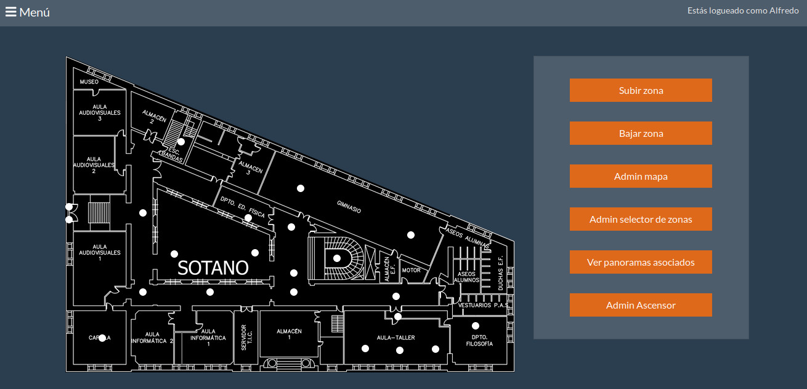

Ahora puede comenzar a subir sus fotografías 360 a la plataforma. El procedimiento general para agregar una fotografía 360 es el siguiente:

1. Haga clic *con el botón derecho del ratón* en la zona del mapa a la que corresponda la fotografía que quiere subir.
2. Asigne un nombre a un lugar (según los nombres que haya diseñado para las distintas fotografías; utilice la nomenclatura que le resulte más cómoda para no perderse) y seleccione el archivo de imagen que contenga la fotografía 360 correspondiente a ese lugar. Por defecto, la aplicación asignará como nombre del lugar el nombre del archivo que contiene la imagen, así que, si se tomó el trabajo de nombrar las fotografías con etiquetas significativas, no tendrá la necesidad de volver a hacerlo aquí.
3. Haga clic en "Enviar" o "Aceptar".

La imagen se subirá y quedará asignada al punto del mapa donde usted haya hecho clic (con el botón derecho). Usted puede comprobarlo porque apacerá un punto blanco en el lugar donde se haya creado la escena.

Repita el proceso con el resto de fotografías 360 que haya realizado para su recorrido virtual. Sea cuidadoso en este proceso, porque constituye el esqueleto de su visita virtual y, si dispone de muchas fotografías, es fácil confundirlas unas con otras. En ese sentido, volvemos a insistir en la importancia de haberlas organizado previamente mediante nombres significativos que usted pueda reconocer bien.

Si comete algún error al subir una fotografía (por ejemplo, si se confunde con el nombre de la zona o si hace clic en el lugar equivocado del mapa), no se preocupe. Puede modificar cualquier escena existente haciendo clic *con el botón derecho* encima de un punto blanco que la representa en el mapa. Accederá así a una pantalla como la siguiente en la que podrá modificar cualquier aspecto de la escena, excepto su posición. Para cambiar el lugar del mapa donde la escena se posiciona, debe eliminarla por completo y volver a crearla en el lugar correcto. 

Esto también es necesario para cambiar el punto de vista por defecto asignado a cada escena. Las fotografías panorámicas 360 se crearán con un punto de vista por defecto, pero puede que usted desee cambiarlo. Este punto de vista es el lugar hacia donde "mira la cámara" al visualizar esa escena y se describe mediante dos coordenadas denominadas "Pitch" y "Yaw". Si necesita cambiarlas, puede hacerlo también desde la pantalla de modificación de escenas, haciendo clic en el botón "Modificar pitch y yaw". Eso le mostrará una previsualización de la escena en la que podrá señeccionar el nuevo pitch y yaw haciendo clic con el botón derecho del ratón sobre la escena cuando haya conseguido el punto de vista que deseaba.

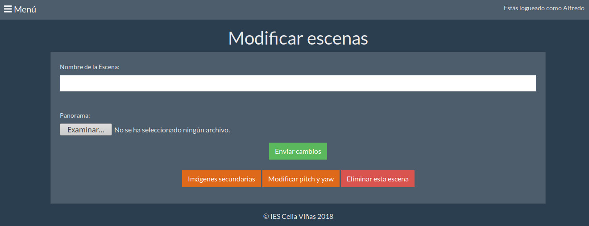

Observe, además, que desde este mismo formulario puede eliminar la escena si necesita hacerlo. Esto eliminará también el archivo subido al servidor, así como cualquier hotspot que exista asociado a la misma. Como es una opción destructiva cuyo efecto no se puede deshacer, debería estar seguro de que desea eliminar esa escena antes de proceder a ello.

Si su visita virtual dispone de varias zonas (varios planos), puede cambiar de uno a otro con los botones "Subir zona" y "Bajar zona" para crear las escenas en el plano adecuado.

Repita el proceso hasta que haya subido todas las fotografías. Si hace clic con el boton izquierdo en cualquiera de las escenas creadas (es decir, en cualquiera de los puntos blancos del mapa) podrá ver una previsualización de cada escena tal y como la verán sus visitantes cuando el tour virtual esté listo. Haga clic en el icono superior izquierdo para regresar a la administración de escenas.

No es imprescindible que suba todas sus fotografías de una vez. Puede crear una parte del recorrido y más adelante volver a esta sección para crear el resto.

Cuando haya terminado de subir sus fotografías 360, llega el momento de conectarlas entre sí para poder navegar de una a otra y crear así el recorrido virtual para sus visitantes. También puede crear puntos de interés (hotspots) dentro de cada una de las fotografías panorámicas. De todo ello hablaremos en las siguientes secciones.

# Subir imágenes, audios y vídeos

En esta sección le mostraremos cómo puede subir imágenes, audios y vídeos que luego utilizará en sus visitas virtuales, tanto en la visita libre como en la guiada o en la de puntos destacados. Estas imágenes, audios y vídeos se pueden asignar a puntos sensibles (hotspots) dentro de sus fotografías 360 para que sus visitantes puedan hacer clic en ellos y  acceder al contenido (galerías de imágenes, audiodescripciones u otro tipo de sonidos, y vídeos).

Si lo que desea es crear los vínculos para enlazar unas escenas con otras y crear así su visita virtual, puede saltarse de momento esta sección e ir a [la siguiente](#hotspots). Siempre puede volver más tarde aquí para aprender a administrar sus imágenes, audios y vídeos.

En lo que sigue, nos referiremos siempre a la administración de imágenes, ya que la administración de audios y vídeos es exactamente igual. Por lo tanto, todo lo que digamos para las imágenes es aplicable a los audios y los vídeos. Solo cuando haya alguna diferencia significativa, nos referiremos a ella explícitamente.

Para administrar sus imágenes, audios y vídeos, debe entrar al panel de administración con un usuario con los privilegios necesarios para administrar las imágenes, audios o vídeos. Si tiene dudas respecto a cómo hacer esto, consulte antes [esta sección](#mapa).

Una vez que esté dentro del panel de administración, despliegue el menú principal de opciones y seleccione "Imágenes", "Audios" o "Vídeos", según la parte de su aplicación que vaya a administrar a continuación. Le aparecerá una pantalla semejante a esta (se muestra la pantalla de administración de imágenes):

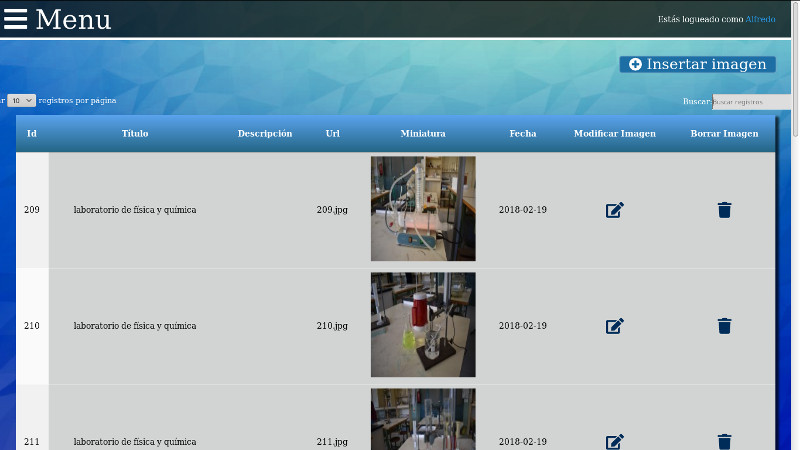

La operativa con esa pantalla es muy sencilla. Usted puede:

* Buscar una imagen/audio/vídeo escribiendo un texto en el recuadro etiquetado como "Buscar".
* Elegir la cantidad de imágenes/audios/vídeos que quiere ver en cada pantallazo seleccionando otra cantidad en "Mostrar 10 registros por página".
* Ordenar la tabla por cualquier campo haciendo clic en el encabezado del mismo. Por ejemplo, si hace clic en "Título", la tabla se ordenará alfabéticamente según los títulos de las imágenes/audios/vídeos. Si hace clic por segunda vez en "Título", obtendrá una ordenación alfabética inversa por ese campo.
* Insertar una nueva imagen/audio/vídeo. Para ello, haga clic en "Insertar" y rellene los campos que la aplicación le pida. En el caso de la imagen y el audio, tendrá que subir el archivo desde el disco duro de su ordenador. Solo se admiten imágenes en formato JPG y audios en formato MP3, en cualquier calidad. En cuanto a los vídeos, de momento la aplicación solo soporta vídeos subidos a Vimeo. Puede usted abrirse una cuenta gratuita en esa plataforma de streaming y subir los vídeos allí. Tendrá que indicarle a Celia360 la dirección web de los vídeos, que será lo único que necesite la aplicación para reproducir esos vídeos a partir de los servidores de Vimeo.
* Modificar una imagen/audio/vídeo ya existente, haciendo clic en el icono de "Modificar" de cada fila de la tabla.
* Eliminar una imagen/audio/vídeo ya existente, haciendo clic en el icono de "Eliminar" de cada fila de la tabla. La aplicación le pedirá que confirme el borrado. Tenga en cuenta que no podrá eliminar una imagen/audio/vídeo si está siendo usada en algún hotspot. Primero deberá eliminar el hotspot. Consulte la [sección 7](#hotspots) para más información sobre hotspots.

# Definir hotspots (puntos de interés) en las escenas

Los hotspots o puntos sensibles son los lugares de su tour virtual con los que el usuario podrá interactuar para acceder a galerías de imágenes (que en adelante denominaremos "paneles informativos"), audiodescripciones (o, en general, sonidos) y vídeos. También son hotspots los enlaces entre una escena y la siguiente que aparecen en las escenas como flechas que le permiten desplazarse por su tour virtual. Finalmente, un tipo de hotspot especial es que hemos denominado "escalera", que permite al visitante saltar de una zona a otra dentro de la visita virtual.

En esta sección le mostraremos cómo puede crear los hotspots dentro de sus escenas y cómo puede asociarles imágenes, audios y vídeos de los que ya haya subido a la plataforma.

En primer lugar, debe haber subido previamente los recursos (imágenes, audios o vídeos) según se explica en la [sección 6](#subirimagenes) de este manual. Puede encontrar allí más información sobre cómo hacer esto.

Una vez que su material multimedia está subido al servidor, puede crear un hotspot siguiendo estos pasos:

1. Acceda a la aplicación con un usuario con privilegios suficientes para crear hotspots. Para más información sobre cómo acceder al panel de administración, consulte la sección [crear el mapa](#mapa).
2. El panel de administración se abrirá directamente en la administración del mapa. Si no fuera así, vaya al menú principal y seleccione la opción "Mapa".
3. Seleccione la escena a la que quiere agregar un hotspot haciendo clic sobre el punto blanco correspondiente. Recuerde que puede cambiar de zona del mapa con los botones "Subir zona" y "Bajar zona".
4. Se abrirá una previsualización de la imagen 360 de la escena que haya seleccionado. Muévase por la escena hasta localizar el punto exacto donde quiere crear el hotspot. Cuando lo tenga en su pantalla, haga clic <i>con el botón derecho</i>. Se le pedirá confirmación sobre si quiere crear un hotspot en ese punto. Responda afirmativamente.
5. Aprecerá una pantalla de selección del tipo de hotspot. Según el tipo que elija, la aplicación le solicitará unos datos diferentes, así que trataremos cada tipo por separado en las secciones siguientes.

Cuando culmine este proceso, habrá creado su hotspot y ya estará disponible para los visitantes de su tour virtual. Puede comprobando lanzando una visita libre en su navegador web y saltando, a través del mapa, hasta la escena donde haya creado el hotspot para asegurarse de que todo funciona correctamente y estar seguro de cómo van a ver sus visitantes el hotspot.

En las siguientes secciones, le indicaremos qué información debe proporcionar al sistema para crear cada uno de los tipos de hotspot que existen:

* [Hotspots de tipo enlace entre escenas](#enlace)
* [Hotspots de tipo panel informativo (galerías de imágenes)](#panel)</a>
* [Hotspots de tipo audio](#audio)
* [Hotspots de tipo vídeo](#video)
* [Hotspots de tipo escalera](#escalera)
* [Cambiar el punto de vista inicial de una escena](vistainicial)

En esta captura de pantalla puede observar cómo verá su visitante cada uno de los tipos de hotspot dentro de una escena:

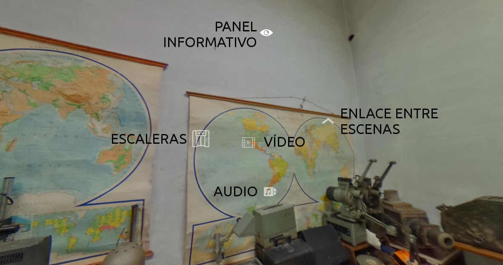

## Hotspots de tipo enlace entre escenas

Estos son los primeros hotspots que necesitará crear, ya que son imprescindibles para la navegación de sus visitantes por su tour virtual.

Los hotspots de tipo enlace permiten que un visitante salte de una escena a la siguiente. Se muestran en la visita como flechas que apuntan hacia la siguiente escena:

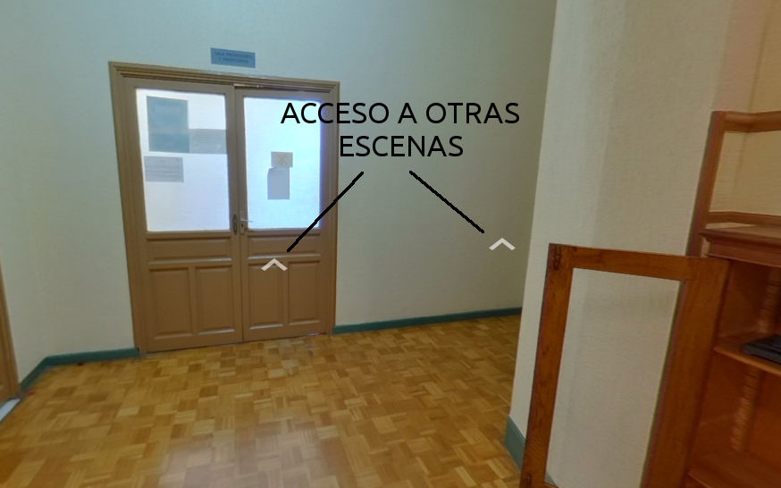

Para crear un hotspot de tipo enlace, siga el procedimiento general para crear un hotspot cualquiera descrito en el [apartado 7](#hotspots). Cuando llegue a la pantalla de selección del tipo de hotspot, haga clic en la opción "Punto de salto a otra escena". Le aparecerá una pantalla semejante a esta:

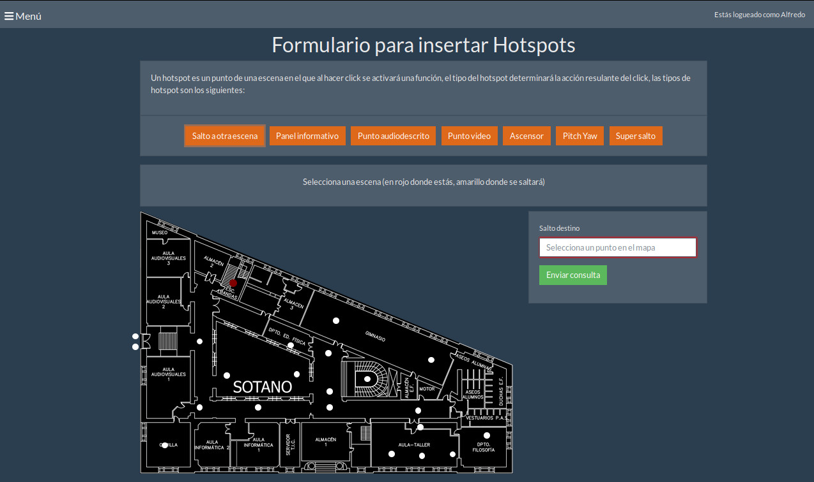

En la pantalla se le mostrará el mapa de la zona donde está la escena en la que está creando el hotspot. Dicha escena estará marcada con un punto de color rojo. Para crear un salto desde esa escena hasta otra, haga clic en un punto blanco adyacente. El punto se ilumnará en amarillo. Confirme que ese es el punto correcto pulsando el botón "Enviar" o "Aceptar".

Su enlace entre escenas se habrá creado. Puede comprobar que funciona correctamente lanzando en su navegador web una visita libre y navegando hasta la escena implicada.

El proceso de creación de enlaces entre escenas puede llegar a ser confuso, ya que necesitará crear muchos de estos enlaces para que sus visitantes puedan navegar con soltura entre sus escenas. Le recomendamos que planifique adecuadamente la tarea con ayuda de unos planos impresos de su recorrido, donde pueda ir señalando qué enlaces ha creado ya y cuáles le faltan por crear.

Otro aspecto de estos enlaces que probablemente necesitará afinar es el punto de vista de las escenas. Recuerde que cada escena tiene un punto de vista predeterminado, definido mediante una pareja de coordenadas denominadas "pitch" y "yaw", que establece hacia dónde "mira la cámara" al entrar en esa escena. Sin embargo, cuando usted está recorriendo sus escenas mediante enlaces creados de una a la otra, es posible que ese punto de vista predeterminado resulte inadecuado. Una situación típica ocurre cuando usted recorre, por ejemplo, un pasillo de su instalación y, después de saltar de una escena A a otra escena B situada, digamos, más al sur, al visualizar la escena B la cámara aparece mirando hacia el norte, el este o el oeste. Eso puede desorientar notablemente a sus visitantes, que esperarán de forma inconsciente seguir mirando hacia el sur cuando saltan a la escena siguiente.

Usted puede sobreescribir el punto de vista por defecto de cada escena en cada uno de los hotspot de tipo salto que enacen con ella. Simplemente, haga clic en el punto del mapa que representa a esa escena de origen, localice el hotspot de tipo salto que conduce a la escena de destino y haga clic en él. Aparecerá una previsualización de la escena de destino donde podrá seleccionar (haciendo clic con el botón derecho, como es habitual) el punto de vista con el que se verá esa escena *solo si se accede a ella desde ese hotspot de dicho salto*. El punto de vista predeterminado permanecerá inalterado y será el que se use para esa escena en cualquier otra circunstancia.

Le recomendamos que planifique los posibles recorridos que sus visitantes podrán hacer en su tour virtual, dibujándolos (tal vez con colores diferentes) sobre un plano impreso, y que luego vaya recorriendo esos puntos en ese mismo orden para ir orientando correctamente los puntos de vista iniciales de cada escena en ese recorrido en concreto.

## Hotspots de tipo panel (galería de imágenes)

Los hotspots de tipo panel informativo son galerías de imágenes que puede asociar a puntos concretos de su recorrido virtual. Adicionalmente, puede asociar un texto informativo y/o un documento PDF descargable para ampliar la información sobre ese punto de su recorrido. Típicamente, los paneles informativos se utilizan para resaltar lugares concretos de su visita virtual donde desea ofrecer fotografías de detalle e información adicional a su visitante. Una vez creado, el hotspot tendrá este aspecto:

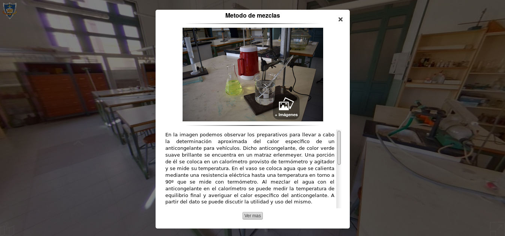

Le recomendamos que suba previamente todas las imágenes que vaya a usar en su panel informativo. Para ver cómo subir imágenes, visite la [sección 6](#subirimagenes). Es buena idea asignar a todas las imágenes que vayan a formar parte de un panel un mismo título genérico, aunque la información de detalle de cada una de ellas sea diferente. Eso le permitirá localizarlas con más facilidad cuando vaya a asignarlas a su panel.

Para crear un hotspot de este tipo, siga el procedimiento genérico expuesto en la [sección 7](#hotspots). Cuando tenga que elegir el tipo de hotspot, haga clic en "Punto panel informativo". Verá en su navegador una pantalla como esta:

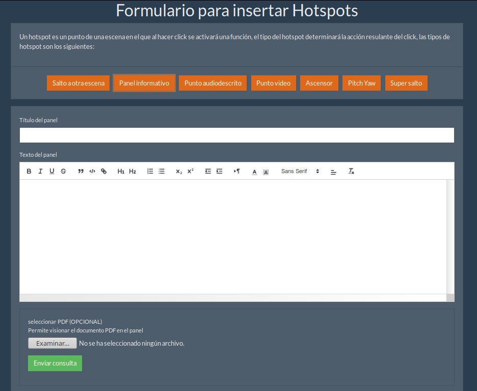

En ese formulario deberá seleccionar:

* **El título del panel**: Se mostrará como título principal durante la visita virtual.
* **Una descripción del panel**: Puede redactar aquí una descripción más amplia del elemento de su tour virtual que está tratando de destacar con este panel.
* **Documento**: Puede subir un documento (preferentemente un archivo PDF) que sus visitantes podrán descargar para ampliar la información sobre el punto destacado, o bien para ofrecer a sus visitantes un documento imprimible sobre el mismo.</li>

Cuando haya terminado, pulse "Enviar" o "Aceptar". Tendrá ahora que seleccionar las fotografías que aparecerán en este panel a través de una pantalla como esta:

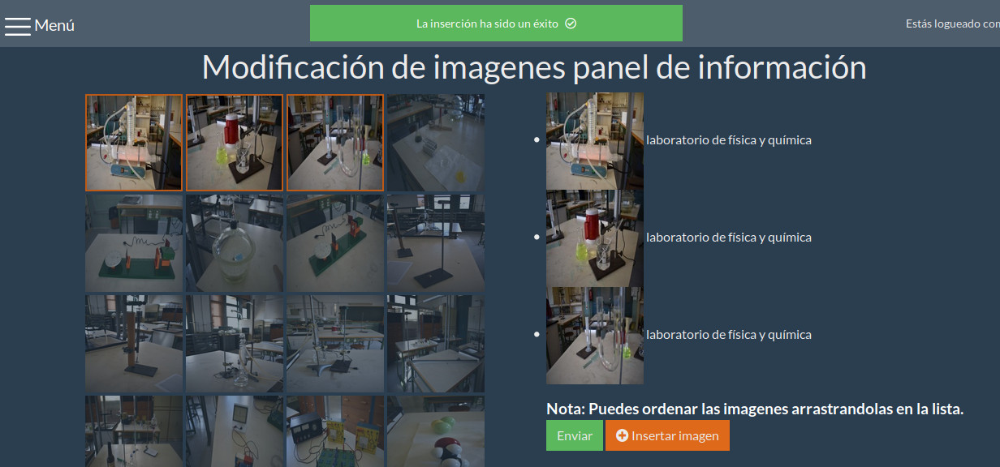

Haga clic en las imágenes de la izquierda para agregarlas a su panel. Si selecciona una imagen por error, haga clic de nuevo sobre ella para eliminarla de la selección.

Pulse "Enviar" o "Aceptar" para guardar los cambios, y "Volver atrás" para cancelar la operación. Cuando haya aceptado los cambios, su hotspot tipo panel informativo estará listo. Puede comprobar cómo ha quedado lanzando una visita libre desde su navegador web y saltando a la escena en cuestión por medio del mapa.

## Hotspots de tipo audio

Los hotspots de tipo audio están pensados para asignar audiodescripciones a puntos concretos de su recorrido virtual. Por supuesto, puede utilizarlos para insertar cualquier sonido o música en ese punto, según la información que quiera ofrecer a sus visitantes. Una vez creado, el hotspot tendrá este aspecto:

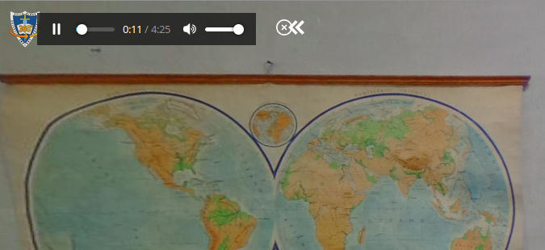

Le recomendamos que suba previamente todos los sonidos que vaya a usar. Para ver cómo subir archivos de audio, visite la [sección 6](#subirimagenes).

Para crear un hotspot de tipo audio, siga el procedimiento genérico expuesto en la [sección 7](#hotspots). Cuando tenga que elegir el tipo de hotspot, haga clic en "Punto audiodescrito". Verá en su navegador una pantalla como esta:

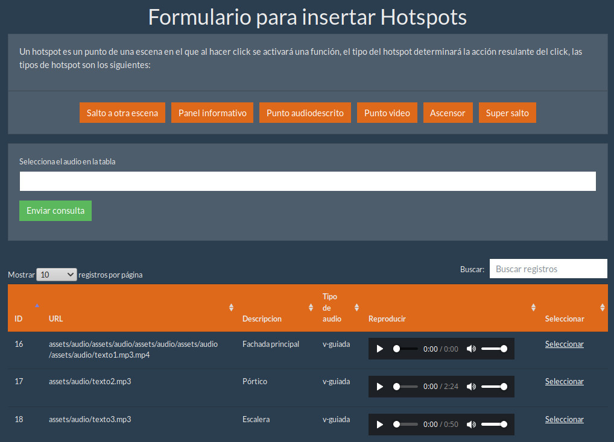

En ese formulario deberá seleccionar uno de los archivos de audio de la lista para asociarlo al hotspot. Puede reproducir el audio desde esta misma pantalla para asegurarse de que es el correcto. También puede usar el buscador, para localizar el audio por su título o descripción, y el paginador para navegar a lo largo de toda la lista de audios, en caso de que haya subido muchos.

Cuando haya terminado, pulse "Enviar" o "Aceptar". Su hotspot de tipo audio estará listo. Puede comprobar cómo ha quedado lanzando en su navegador una visita libre y saltando hasta la escena donde haya creado el hotspot mediante el mapa.

## Hotspots de tipo vídeo

Los hotspots de tipo vídeo le permiten insertar vídeos en puntos concretos de su recorrido virtual. A diferencia de las imágenes o los archivos de sonido, los vídeos no estarán alojados en su servidor, ya que pocos servidores pueden soportar vídeos en términos de tamaño de archivo y ancho de banda. En lugar de ello, deberá alojar los vídeos en un proveedor de streaming externo. De momento, la aplicación soporta únicamente vídeos alojados en Vimeo, que es un servicio libre de publicidad y gratuito para vídeos sin ánimo de lucro. Una vez creado, el hotspot tendrá este aspecto:

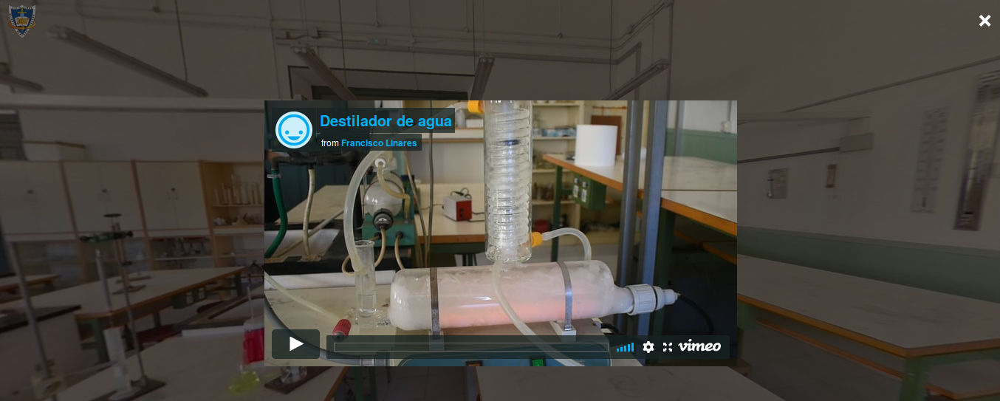

Le recomendamos que suba previamente todos los vídeos que vaya a usar. Para ver cómo subir vídeos, visite la [sección 6](#subirimagenes)</a>.

Para crear un hotspot de tipo vídeo, siga el procedimiento genérico expuesto en la [sección 7](#hotspots). Cuando tenga que elegir el tipo de hotspot, haga clic en "Punto vídeo". Verá en su navegador una pantalla como esta:

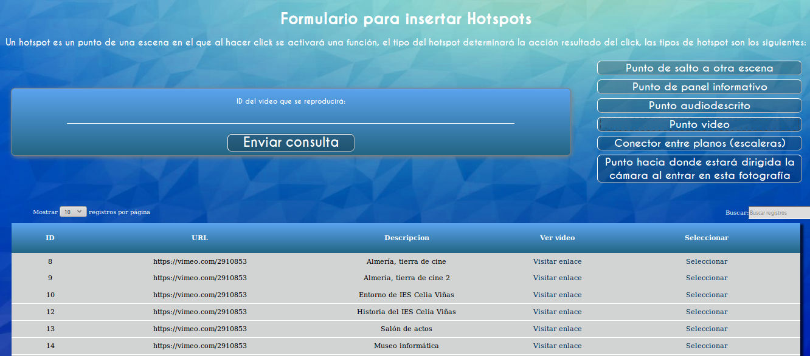

En ese formulario deberá seleccionar uno de los vídeos dados de alta en la plataforma (y que, a su vez, deben estar subidos a Vimeo). Puede reproducir el vídeo desde esta misma pantalla para asegurarse de que es el correcto. También puede usar el buscador, para localizar el vídeo por su título o descripción, y el paginador para navegar a lo largo de toda la lista de vídeos, en caso de que disponga de muchos.

Cuando haya terminado, pulse "Enviar" o "Aceptar". Su hotspot de tipo vídeo estará listo. Puede comprobar cómo ha quedado lanzando en su navegador una visita libre y saltando hasta la escena donde haya creado el hotspot mediante el mapa.

## Hotspots de tipo escalera

Los hotspots de tipo escalera se utilizan para que los visitantes de su tour virtual puedan cambiar de zona, es decir, puedan acceder a otro de sus mapas. Una vez creado, el hotspot tendrá este aspecto:

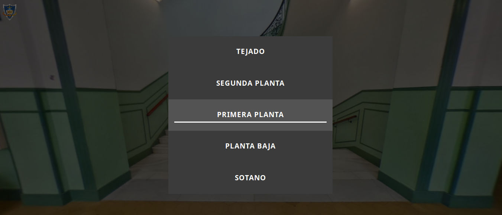

Le recomendamos que planifique dónde va a crear sus hotspots de tipo escalera. Suelen quedar bien haciéndolos coincidir con las escaleras y/o ascensores de sus fotografías 360, o bien con los saltos entre zonas si su recorrido es plano.

Para crear un hotspot de tipo escalera, siga el procedimiento genérico expuesto en la [sección 7](#hotspots). Cuando tenga que elegir el tipo de hotspot, haga clic en "Conector entre planos (escaleras)". Verá en su navegador una pantalla como esta:

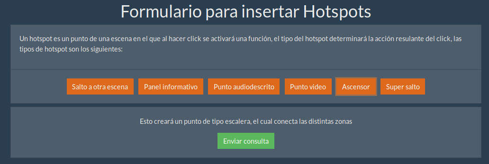

Este hotspot no requiere de ninguna información adicional, por lo que solo deberá pulsar "Enviar" o "Aceptar" para confirmar la creación del hotspot. Puede comprobar cómo ha quedado lanzando en su navegador una visita libre y saltando hasta la escena donde haya creado el hotspot mediante el mapa.

## Cambiar el punto de vista inicial de una escena

Por último, desde la misma pantalla de creación de hotspots puede modificar el punto de vista inicial de una escena. Esto se refiere a que, cada vez que entre en esta escena, la cámara mirará hacia el punto en el que acabe de hacer clic durante la previsualización de la escena.

Para asignar las coordenadas sobre las que hizo clic como punto de vista inicial de una escena, simplemente siga el mismo procedimiento genérico de creación de hotspots descrito en la [sección 7](#hotspots) y luego haga clic en el botón "Punto hacia donde estará dirigida la cámara".

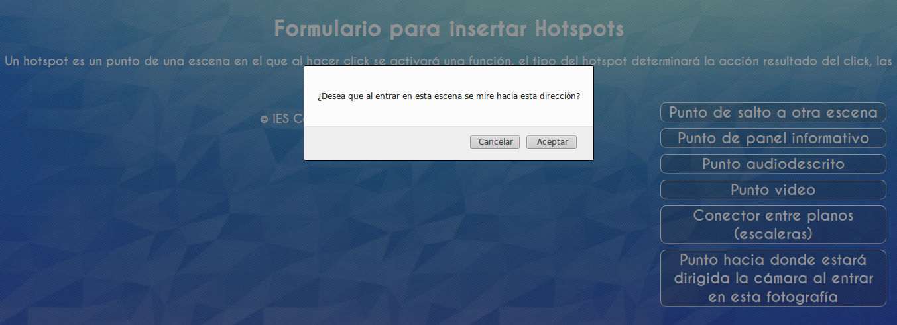

Confirme la operación y las nuevas coordenadas iniciales de la escena se grabarán. Puede comprobar cómo ha quedado lanzando en su navegador una visita libre y saltando hasta la escena en cuestión. Al entrar en ella, el punto de vista debería ser el que usted seleccionó.

## Modificar un hotspot ya existente

Usted puede modificar y/o eliminar un hotspot ya existente, sea cual sea su tipo. Para lograrlo necesitará seguir estos pasos:

1. Acceda al panel de administración y seleccione la opción "Mapa" para administrar el mapa. Si no sabe cómo hacer esto, revise la [sección 4](#mapa).
2. Seleccione la escena en la que está el hotspot que quiere modificar o borrar. Bastará con que haga clic sobre el punto del mapa correspondiente. Recuerde que puede cambiar de mapa con los botones "Subir zona" y "Bajar zona".
3. Se abrirá la previsualización de la escena, y en ella aparecerán todos los hotspot activos en esa escena. Haga clic en cualquiera de ellos para modificarlo o eliminarlo.

En su navegador se abrirá una ventana nueva que le permitirá modificar algunos aspectos de su hotspot y también eliminarlo. Tenga cuidado con cualquiera de las dos opciones, pues su efecto es irreversible. Lógicamente, las opciones son diferentes según cada tipo de hotspot. Por ejemplo, la ventana para modificar un hotspot de tipo salto entre escenas tiene un aspecto como este:

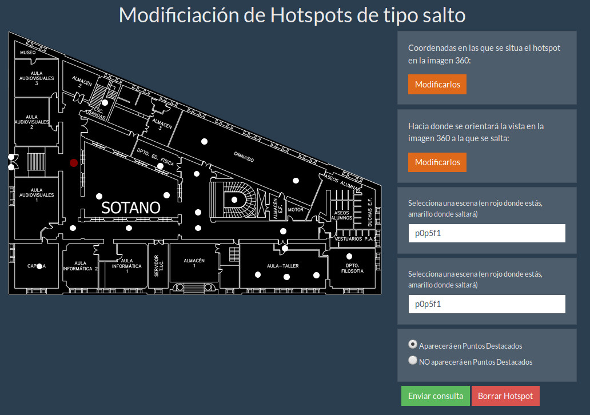

Algunas ventanas de modificación de hotspot no le permitirán cambiar ciertas cosas del hotspot. Si necesita modificar alguno de estos aspectos invariables, deberá borrar el hotspot y crearlo de nuevo.

# Crear una visita guiada

La visita guiada le permite crear una visita preprogramada en la que el visitante será conducido por las escenas más interesantes o representativas de su recorrido virtual automáticamente, mientras una audiodescripción ilustra al visitante acerca de la escena que está contemplando.

Obviamente, antes de poner en marcha una visita guiada, usted necesitará haber subido previamente las fotografías panorámicas de 360º (vea la [sección 5](#escenas) si no tiene claro como hacerlo) y las audiodescripciones (consulte la [sección 6](#subirimagenes) si tiene dudas al respecto).

Cuando tenga preparadas las escenas de su visita guiada y sus respectivas audiodescripciones, el proceso para crear su visita guiada es muy sencillo:

1. Entre en el panel de administración utilizando un usuario con privilegios suficientes (consulte la [sección 4](#mapa) si no sabe cómo hacerlo).
2. En el menú principal, elija la opción "Guiada". Se encontrará con una pantalla como esta: 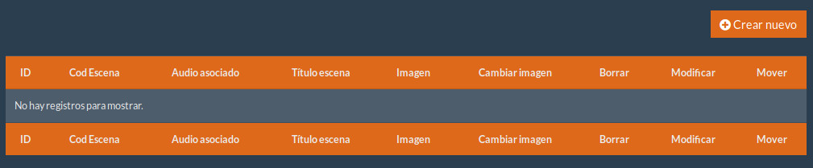
3. Cree el primer punto de su visita guiada haciendo clic en "Nuevo". Se le pedirá que seleccione una escena y un archivo de audio de entre todos los subidos a la plataforma. También tendrá que escribir un título descriptivo del lugar y una imagen representativa. Cuando termine, pulse "Aceptar" o "Enviar": 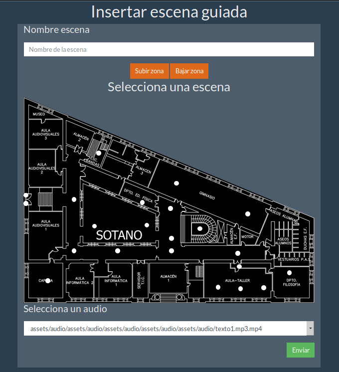
4. Añada los demás puntos de su visita guiada repitiendo el paso anterior tantas veces como sea necesario.
5. Si se equivoca al seleccionar alguna escena y/o audiodescripción, pulse el botón "Modificar" de la fila correspondiente en la tabla y cambie lo que sea necesario. También puede eliminar por completo ese punto de la visita guiada haciendo clic en el botón "Eliminar" de esa fila.
6. Si se equivoca en el orden en el que se deben mostrar las escenas en la visita guiada, o desea cambiarlo más adelante por alguna razón, pulse las flechas "Arriba" y "Abajo" de cada fila de la tabla, que provocarán una reordenación de las escenas.

Cuando haya terminado, la pantalla de administración de la visita guiada debería tener un aspecto semejante a este:

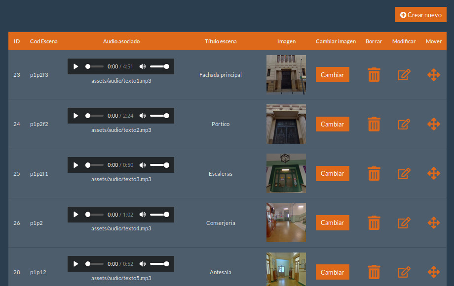

Su visita guiada está ahora lista. Puede probarla lanzando la aplicación en un navegador web y seleccionando "Visita guiada" en la pantalla principal, como si usted fuera un visitante. La visita guiada se iniciará. Puede navegar por ella usando los botones "Siguiente" y "Anterior". También puede desplegar la lista de escenas haciendo clic en el icono del faro y saltar así cómodamente de una a otra. Si deja que la visita guiada fluya a su ritmo, saltará automáticamente de una escena a otra cuando se termine la audiodescripción de cada escena. Por supuesto, también puede pausar el audio y reanudarlo a voluntad.

Si le parece que el tiempo de espera entre el fin de un audio y el comienzo del siguiente es demasiado corto, le recomendamos que deje unos segundos de silencio al final de cada audiodescripción.

# Crear una visita de puntos destacados

Los puntos destacados le permiten crear un mosaico con las escenas más interesantes de su visita. Al hacer clic en cada una de las celdas que componen el mosaico, su visitante accederá a la escena 360 correspondiente a esa celda. Usted puede, lógicamente, decidir qué imágenes aparecerán en el mosaico y con qué escenas estarán enlazadas. Además, puede diseñar el mosaico con una libertad casi absoluta, de manera que puede destacar solo unas pocas escenas de su visita, o bien hacer una selección más amplia que incluya un buen número de ellas, todo con un interfaz amigable que le permite en todo momento tener en pantalla una previsualización del resultado. De todo ello hablaremos en esta sección.

Para acceder al diseño de puntos destacados, debe usted entrar en el panel de administración con un usuario con los privilegios suficientes (vea la [sección 4](#mapa) para más detalles sobre esto) y, después, desplegar el menú principal y hacer clic en "Destacados". Si es la primera vez que entra en esta sección, verá un diseño de celdas vacías semejante a este:

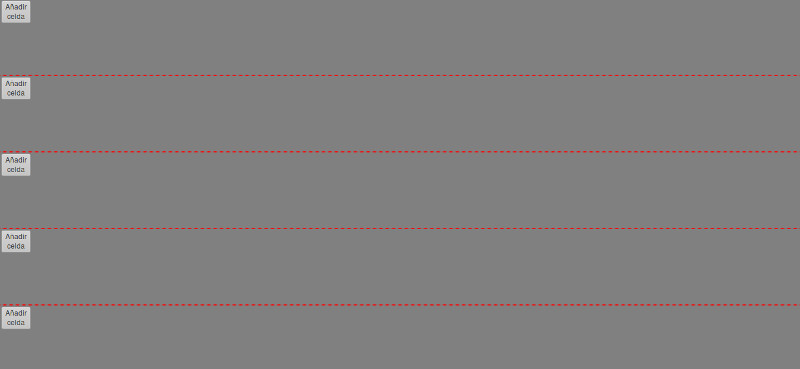

A partir de esa plantilla vacía, puede usted crear su propio diseño de celdas. Para crear una de las celdas, simplemente elija en cual de las filas disponibles quiere hacerlo y haga clic en "Añadir celda". Se desplegará un formulario en el que podrá especificar:

* Un nombre o etiqueta identificativa para la celda. Los visitantes lo verán aparecer al situal el ratón encima de la celda.
* Una imagen que representará el lugar. Puede recortar un fragmento de la fotografía panorámica 360 de ese lugar, o utilizar cualquier otra foto representativa que considere adecuada. Solo se admite el formato JPG.
* La escena a la que enlazará esta celda, es decir, el punto de su mapa al que saltará el visitante si hace clic en la celda.

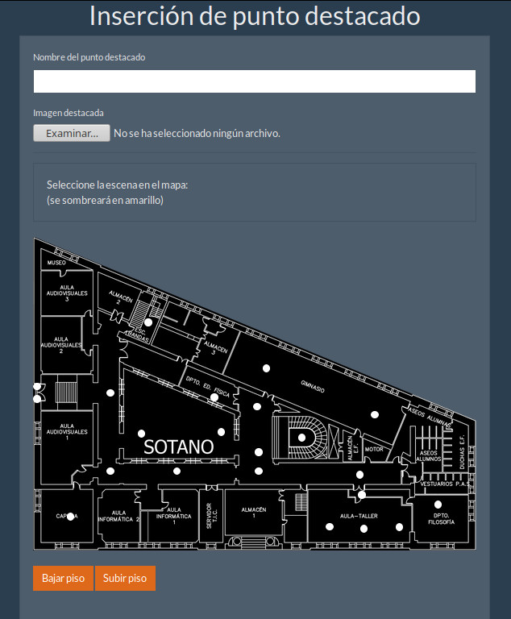

Al pulsar el botón de "Enviar" o "Aceptar" se creará la celda en la fila seleccionada. La aplicación regresará a la pantalla de diseño de celdas, donde le mostrará la previsualización de su diseño de celdas:

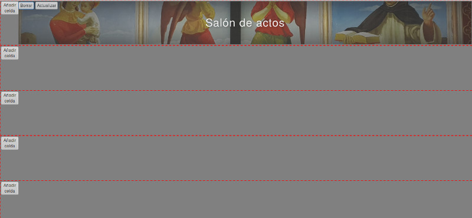

Una aspecto importante en el diseño de los puntos destacados es que es necesario limitar el movimiento del visitante dentro de la zona del mapa a la que nos conduzcan los puntos destacados. Para ello, necesitará deshabilitar los hotspots de enlace entre escenas que permiten salir de esa zona del tour. Esto se hace en la configuración de los propios hotspots, y debe acudir allí para hacerlo. En los hotspots tipo enlace podrá seleccionar si desea que cada hotspot aparezca en la vista de puntos destacados o no. Revise el [seccion 7.1](#enlace) para más información.

Por ejemplo, si usted crea un punto destacado que apunta a una gran estancia de su visita, puede que prefiera conservar un par de enlaces dentro de esa escena para que el visitante pueda saltar a las escenas adyacentes, pero tendrá que deshabilitar para la visita de puntos destacados los enlaces que conducen <i>fuera</i> de esa estancia para que el visitante no pueda salir de ella (tenga en cuenta que esto no afecta a la visita libre, en la que <i>todos</i> los hotspots de tipo enlace entre escenas estarán siempre disponibles).

En cambio, si el punto destacado conduce a una estancia pequeña, en cuyo interior solo ha tomado una fotografía panorámica 360, puede deshabilitar todos los hotspots tipo salto de esa escena para que no aparezcan en la visita de puntos destacados, y así el visitante, en este tipo de visita, no podrá salir de esa estancia.

Puede modificar cualquier aspecto de los puntos destacados que ya ha creado haciendo clic en el botón "Modificar" que aparece en la esquina superior izquierda de cada celda en la pantalla de diseño. Ahí podrá cambiar el título, la imagen asociada, la escena a la que enlaza y también el número de la fila en la que se encuentra la celda, de modo que la puede hacer subir y bajar la celda a voluntad.

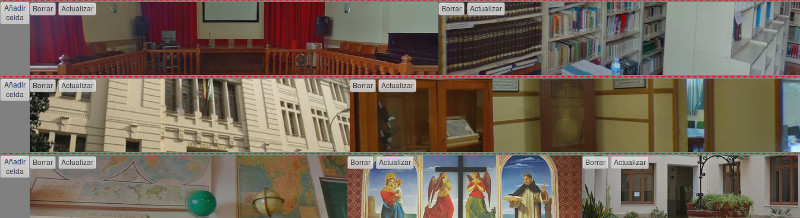

Por último, también puede eliminar cualquier celda en cualquier momento haciendo clic en el boton "Eliminar" de cada una de ellas.

# Configurar la portada (homepage)

Muchos aspectos de la portada (homepage) de su visita virtual son configurables, para que usted pueda decidir el aspecto que quiere ofrecer a sus visitantes. En esta sección le mostraremos qué cosas puede configurar en su portada y cómo puede hacerlo.

Para acceder a la configuración de la portada, debe entrar al panel de administración con un usuario que tenga los privilegios adecuados. Una vez hecho esto, seleccione "Portada" en el menú principal. Accederá a una pantalla como esta:

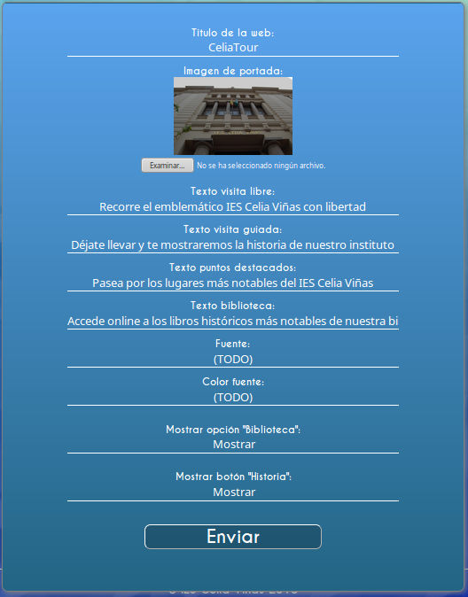

En esa pantalla puede modificar los siguientes aspectos de su portada:

* **Título de la web**: es el título principal de su web, que aparece en posición central y destacada en el homepage.
* **Imagen de portada**: se refiere a la imagen de fondo de la portada. Le recomendamos que elija una imagen atractiva y no excesivamente contrastada, de manera que no dificulte la lectura del texto.
* **Texto visita libre**: al pasar el ratón sobre cada una de las opciones del menú principal (Visita libre, Visita Guiada, Puntos destacados, Biblioteca y Créditos) aparece, en sustitución del título de la web, un breve texto descriptivo de qué puede encontrar el visitante en esa opción. Puede especificar aquí el texto que desea que aparezca al pasar el ratón sobre la opción de "Visita libre".
* **Texto visita guiada**: indique aquí el texto explicativo que desea que aparezca en pantalla al poner el ratón sobre la opción "Visita guiada".
* **Texto puntos destacados**: indique aquí el texto explicativo que desea que aparezca en pantalla al poner el ratón sobre la opción "Puntos destacados".
* **Texto biblioteca**: indique aquí el texto explicativo que desea que aparezca en pantalla al poner el ratón sobre la opción "Biblioteca".
* **Fuente**: indique una fuente tipográfica diferente de la fuente por defecto. Se admite cualquier fuente instalada en su servidor, o bien fuentes disponibles en Google Fonts.
* **Color fuente**: cambie aquí el color por defecto de sus textos para adaptarlos a imágenes de fondo diferentes. Por ejemplo, si su imagen de fondo es muy clara, tal vez prefiera seleccionar un color oscuro para su fuente, y viceversa.
* **Mostrar biblioteca**: puede ocultar la opción de menú "Biblioteca" si no tiene pensado digitalizar libros o documentos relativos a su visita virtual para ofrecerlos a sus visitantes. Consulte la [sección 12](#biblioteca) para más información sobre la biblioteca.
* **Mostrar historia**: puede ocultar el botón "Historia" si no tiene pensado destacar algunos de sus libros digitalizados para mostrar la historia del lugar para el que está diseñando una visita virtual. Consulte la [sección 12](#biblioteca) para más información sobre los libros históricos.

Cuando haya terminado de configurar su portada, pulse el botón "Enviar" para guardar los cambios. Si ahora accede a su homepage, podrá comprobar qué efecto han tenido sus cambios.

# Administrar los usuarios

La gestión de usuarios es crucial para la seguridad de su aplicación. En esta sección le explicaremos cómo puede gestionar los usuarios que tienen acceso al panel de administración y los diferentes perfiles que existen.

Para administrar los usuarios, debe acceder al panel de administración de su aplicación con un usuario con los privilegios suficientes. Consulte la [sección 4](#mapa) si no recuerda cómo hacer esto. Una vez que haya accedido al panel de administración, seleccione la opción "Usuarios" del menú principal. Accederá a una pantalla como esta:

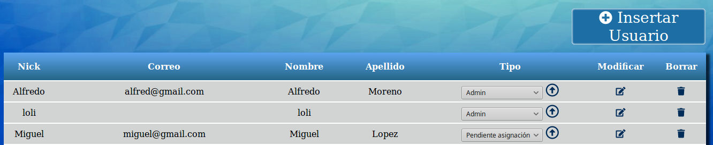

Desde esa pantalla puede visualizar los usuarios activos en ese momento, modificarlos, borrarlos o añadir uno nuevo. El funcionamiento es muy intuitivo y semejante al de otras pantallas del panel de administración, como la administración de imágenes, audios y vídeos:

1. **Para añadir un nuevo usuario**, haga clic en el botón "Insertar usuario" y cumplimente los campos que se le solicitan.
2. **Para modificar un usuario existente**, haga clic en el botón "Modificar" de la fila correspondiente, y modifique los campos que sean necesarios. Desde aquí puede asignar una nueva contraseña a cualquier usuario que la haya perdido u olvidado. Puede dejar como están los campos que no quiera cambiar.
3. **Para eliminar un usuario existente**, haga clic en el botón "Eliminar" de la fila correspondiente. Tenga cuidado: esta acción no se puede deshacer.
4. **Para cambiar el tipo de un usuario existente**, elija el nuevo tipo en la lista desplegable, dentro de la fila correspondiente a ese usuario, y pulse el botón "Subir" que aparece al lado. Observe que también puede cambiar el tipo del usuario desde la ventana general de modificación de usuario.

Existen cuatro perfiles o tipos de usuario, cada uno de los cuales tiene diferente nivel de privilegios sobre la aplicación. De menor a mayor nivel de privilegios, estos perfiles o tipos son:

1. **Pendiente de asignación**: cuando un usuario acaba de registrarse en la aplicación, usted debe asignarle manualmente los privilegios desde el panel de administración. Hasta entonces, figurará como "pendiente de asignación" y no podrá realizar, por motivos de seguridad, ninguna operación con la aplicación hasta que un administrador le asigne otro nivel de privilegios superior.
2. **Bibliotecario**: los usuarios con este perfil solo podrán acceder a la sección de biblioteca, subir libros digitalizados y administrarlos.
3. **Mapero**: los usuarios con este perfil pueden crear mapas y administrar escenas, hotspots, imágenes, audios y vídeos.
4. **Administrador**: los usuarios con este perfil pueden acceder a todas las funciones de bibliotecarios y maperos, además de a la gestión de la portada y a la administración de los propios usuarios.

Durante el proceso de instalación se creará un usuario de tipo administrador. Este usuario tiene un carácter especial, ya que nunca podrá ser eliminado para asegurar el acceso con nivel de administrador a la aplicación. Ni que decir tiene que las credenciales de este usuario, así como las de cualquier otro usuario de tipo administrador, deben permanencer siempre seguras para evitar comprometer la seguridad del sistema.

El **registro de usuarios** se puede hacer desde el panel de administración (opcion "Insertar usuario") o desde la ventana de login, haciendo clic en el botón "Darse de alta". En el primer caso, como el usuario que está haciendo el registro es un administrador, la aplicación le permitirá elegir el nivel de privilegios del usuario nuevo; en el segundo caso, en cambio, el usuario se creará siempre como "pendiente de asignación" para evitar accesos no autorizados al panel de administración de la aplicación. Este segundo formulario de registro de usuarios tiene incorporados varios mecanismos de seguridad ocultos para filtrar los posibles intentos de registro de aplicaciones maliciosas que intenten hacerse pasar por humanos con el fin de saturar el servidor o de comprometer la seguridad de la aplicación.

# Administrar la biblioteca

El módulo de biblioteca es un añadido que enriquece la experiencia de los visitantes a su tour virtual ofreciéndole, en formato digitalizado, publicaciones que tengan relación con el lugar que están visitando. No es un módulo obligatorio, es decir, usted puede desactivarlo si decide no ofrecerlo a sus visitantes. En cambio, si prefiere utilizarlo, asegúrese de no infringir los derechos de propiedad intelectual de las obras que ofrezca en formato digital. Los desarrolladores de la aplicación Celia360, como es natural, declinan toda responsabilidad sobre el uso indebido que los usuarios finales pudieran hacer de esta funcionalidad.

En esta sección le mostraremos cómo puede crear su biblioteca virtual y cómo puede integrarla en su visita.

Para acceder a la administración de la biblioteca, debe entrar al panel de administración con un usuario con privilegios suficientes. Si no sabe cómo hacerlo, revise la [sección 4](#mapa). Una vez hecho esto, seleccione la opción "Biblioteca" del menú principal. Accederá a una pantalla semejante a esta: 

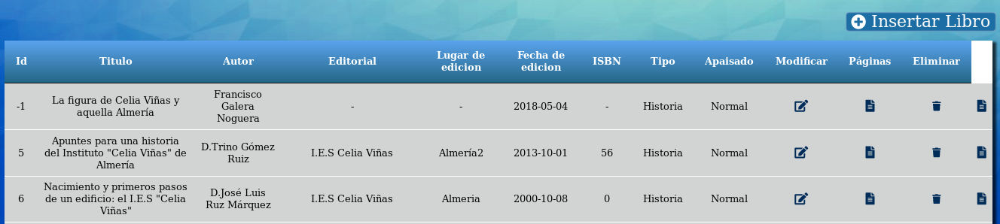

Esta pantalla ofrece las funcionalidades habituales para la administración de cualquier conjunto de datos. Es muy semejante a la administración de imágenes, vídeos, audios o usuarios. Usted puede:

* **Añadir un libro** haciendo clic en "Insertar libro". Más abajo le explicamos algo más acerca de este proceso.
* **Modificar libro**: la información bibliográfica básica de cada libro (título, autor, editorial, etc) puede modificarse haciendo clic en el icono "Modificar" de cada libro. Sin embargo, el contenido del libro, es decir, sus páginas, no se modifican desde aquí, sino desde la opción "Editar páginas" que describimos más abajo.
* **Editar páginas**: aquí se edita el contenido del libro, es decir, sus páginas. Más abajo le explicamos cómo subir el contenido del libro.
* **Eliminar libro**: haciendo clic en el icono de "Eliminar" en la fila de cada libro puede borrarlo de la base de datos y eliminar todos los archivos asociados del servidor. ¡Cuidado! Esta acción no se puede deshacer.
* **Buscar libro**: le permite localizar un libro por cualquier campo: título, autor, editorial, isbn, etc. Simplemente, escriba una cadena de búsqueda en el cuadro reservado para ello encima de la tabla.
* **Ordenar tabla**: haciendo clic en cualquier encabezado de campo de la tabla para ordenarla alfabéticamente por ese campo. Por ejemplo, si quiere ordenar alfabéticamente por título, haga clic en el encabezado "Título". Si hace clic una segunda vez, obtendrá un ordenado alfabético inverso.
* **Paginar tabla**: si en su base de datos hay demasiados libros no se mostrarán todos en la tabla, sino que se paginarán. Puede navegar entre las páginas con el indicador de página en la parte inferior de la tabla. También puede decidir cuántos registros desea ver por página.

El proceso de **inserción de un libro** tiene unos pasos a respetar para que se puedan insertar satisfactoriamente, por lo que necesita una explicación adicional. En general, crear un libro requiere de dos pasos obligatorios: 

1. Crear el libro con la opción "Insertar libro". Esto insertará en la base de datos la información bibliográfica básica (título, autor, editorial, etc), pero <i>no</i> el contenido del libro. Se le pedirá que indique si este libro está destinado a la biblioteca general o es una publicación histórica. La diferencia es que los segundos solo aparecerán al hacer clic en el boton "Historia" del homepage, donde (optativamente) podemos colocar publicaciones que tengan que ver con la historia de nuestro edificio. También se le pedirá que indique si el libro tiene formato apaisado o vertical.

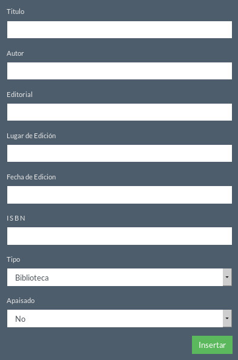

2. Subir las páginas con la opción "Subir". Puede subir las páginas de una en una (si el libro no es muy largo) o seleccionando varias a la vez. Por supuesto, deberá tener las páginas escaneadas previamente y a doble cara del libro cada imagen, excluyendo la portada y contraportada. Tenga en cuenta que las páginas se ordenarán en el servidor según su nombre, es totalmente necesario que se renombren desde 0.jpg, siendo la portada la 0, 1.jpg, 2.jpg... y así sucesivamente. 

Una vez que haya subido tanto la información bibliográfica como el contenido de un libro, puede modificar la primera con la opción "Modificar" del panel de administración y la segunda con la opción "Páginas", como se muestra en la siguiente imagen:

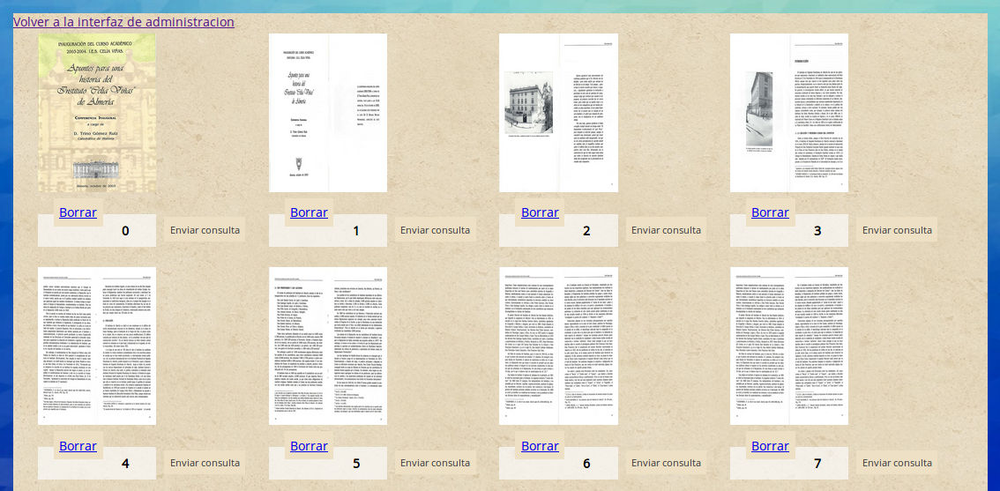

Tenga en cuenta que el catálogo de libros marcados como "Tipo historia" solo aparecerán al pulsar el botón "Historia" del homepage, mientras que el resto de libros aparecerán al seleccionar la opción "Biblioteca" del menú principal del homepage. Ambos enlaces son optativos y se pueden ocultar desde la personalización de la portada (si no sabe cómo hacerlo, revise la [sección 10](#portada)), por lo que le corresponde a usted decidir dónde encaja mejor cada publicación que pretende poner a disposición de sus visitantes o si, por el contrario, no desea ofrecer libros digitalizados en absoluto.

# ¡Su tour virtual está listo!

Cuando haya finalizado de configurar su tour virtual, Celia360 estará preparado para mostrar a sus visitantes una inmersión completa, interactiva y plagada de información útil por el entorno que usted haya fotografiado. En esta sección pretendemos mostrarle cómo puede quedar su tour virtual una vez que lo haya terminado de configurar, ofreciéndole como ejemplo el que nosotros hemos preparado para el IES Celia Viñas de Almería y que puede visitar online en http://iesceliaciclos.org/celia360

Lo primero que verá su visitante cuando acceda a su tour virtual es el homepage o portada. En nuestro caso, tiene este aspecto:

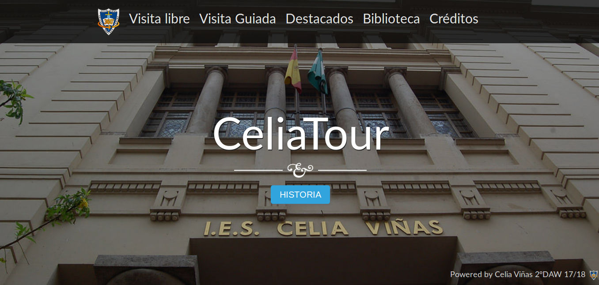

Desde el homepage, sus visitantes pueden acceder a todas las opciones de navegación por su tour virtual. La primera de ellas es la **visita libre**, que permite al visitante moverse por cualquiera de las escenas de sus mapas, bien navegando de una a otra mediante los hotspots de tipo salto o bien accediendo directamente a ellas desde el mapa desplegable:

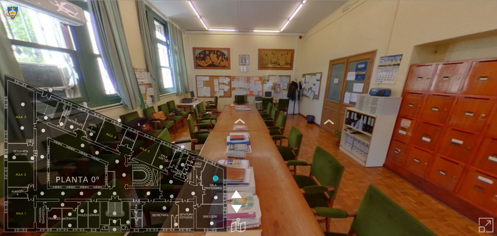

La siguiente opción es la **visita guiada**. En este tour, su visitante será dirigido a través de las escenas que usted haya seleccionado, acompañando cada escena con una audiodescripción. El visitante puede detener la visita en cualquier momento, o bien avanzar o retroceder en la misma con libertad. También puede moverse alrededor de la escena 360 mientras suena la audiodescripción:

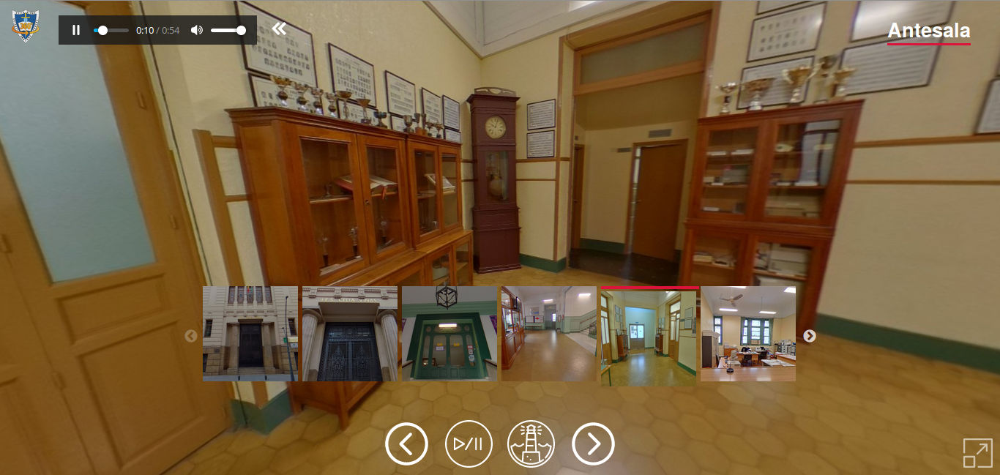

A continuación tenemos la **visita de puntos destacados**. Esta visita mostrará al usuario un mosaico con las imágenes que usted haya seleccionado como más interesantes de su visita. Cada una de ellas dará acceso a una escena limitada, es decir: el visitante podrá moverse libremente en esa escena pero no podrá salir de allí para seguir navegando libremente por el resto del mapa (para eso ya está la visita libre):

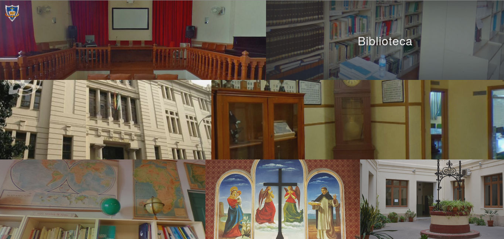

La siguiente opción es la de **biblioteca**. Aquí se mostrará el catálogo de libros (todos menos los marcados como "Tipo historia") y su visitante podrá consultarlos online mediante un visor interactivo. Algunos libros pueden tener la opción de descarga en formato PDF. Tenga en cuenta que puede ocultar esta opción desde la [configuración de la portada](#portada) si no le interesa ofrecer libros digitalizados a sus visitantes. También le recordamos que la obligación de asegurarse de no infringir los posibles derechos de propiedad intelectual es exclusivamente suya y de su organización. El aspecto que tiene la biblioteca para sus visitantes es este:

Y el visor de libros tiene esta forma:

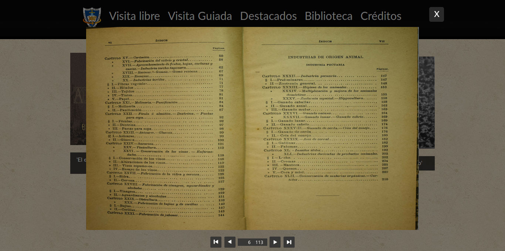

Por último, el botón **Historia** (que también es opcional y puede ocultarse desde [la administración de la portada](#portada)) le dará acceso a un subconjunto de la biblioteca donde solo figurarán los libros o documentos que relaten la historia de su edificio o instalación. El catálogo, en este caso, tiene este aspecto:

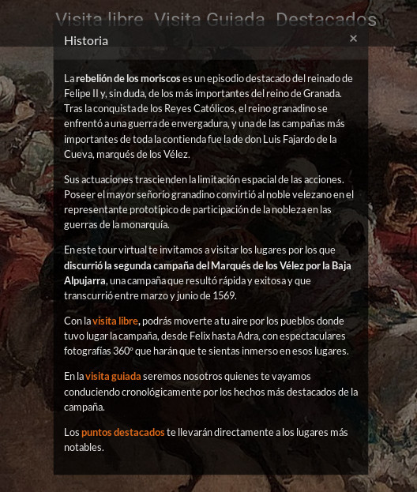

El visor de libros digitales es igual que el que se emplea en la biblioteca general.

# Anexo. Guía de inicio rápida

En esta sección le ofrecemos un resumen de los pasos que debe seguir para crear su tour virtual. Le remitiremos a las secciones correspondientes del manual para ampliar la información sobre cada uno de los aspectos.

Los pasos generales para crear un **tour virtual mínimo** son los siguientes:

1. Desplegar una instalación limpia de la aplicación en un servidor web adecuadamente configurado (más informacion en la [sección 2](#instalacion)).
2. Preparar los archivos con los planos (de su edificio, instalación, etc.) y crear el mapa (más información en la [sección 4](#mapa)).
3. Preparar y organizar los archivos con sus imágenes panorámicas 360 y subirlas a la plataforma (más información en la [sección 5](#escenas)).
4. Crear los hotspots de tipo salto para enlazar unas escenas con otras (más información en la [sección 7.1](#enlace)).
5. Crear al menos un hotspot tipo escalera si su visita consta de más de un mapa (más información en la [sección 7.5](#)).
6. Configurar su portada con una imagen de fondo personalizada y ocultando, si lo desea, los enlaces de "Biblioteca" e "Historia" (más información en la [sección 10](#portada)).

Si lo que quiere, en cambio, es ofrecerle a sus visitantes un **tour virtual completo** y repleto de información, explotando todas las posibilidades de nuestra plataforma, tendrá que realizar algunas tareas adicionales:

1. Dar de alta a usuarios adicionales que puedan echarle una mano con el trabajo de configuración y manenimiento (más información en la [sección 11](#usuarios)).
2. Grabar las audiodescripciones para la visita guiada y crear la visita guiada. Puede que necesite alguna fotografía adicional de cada una de las escenas (más informacion en la [sección 8](#guiada)).
3. Crear la visita de puntos destacados. Puede que necesite alguna imagen adicional de cada una de las escenas (más información en la [sección 9](#destacados)).
4. Subir imágenes (convencionales), audios y vídeos sobre los puntos más importantes de su edificio o instalación, y luego asociarlos a hotspots de tipo panel, audio o vídeo incrustados dentro de sus escenas panorámicas (más información en las secciones [6](#subirimagenes), [7.2](#panel), [7.3](#audio), y [7.4](#video)).
5. Digitalizar libros y documentos de dominio público o de los que posea los derechos y subirlos a la biblioteca, distinguiendo los que constituyen la bibliografía general de los de bibliografía histórica (más información en la [sección 12](biblioteca)). No olvide volver a hacer visibles los enlaces "Biblioteca" y/o "Historia" en la configuración de la portada ([sección 10](#portada)) para poder acceder a la biblioteca.